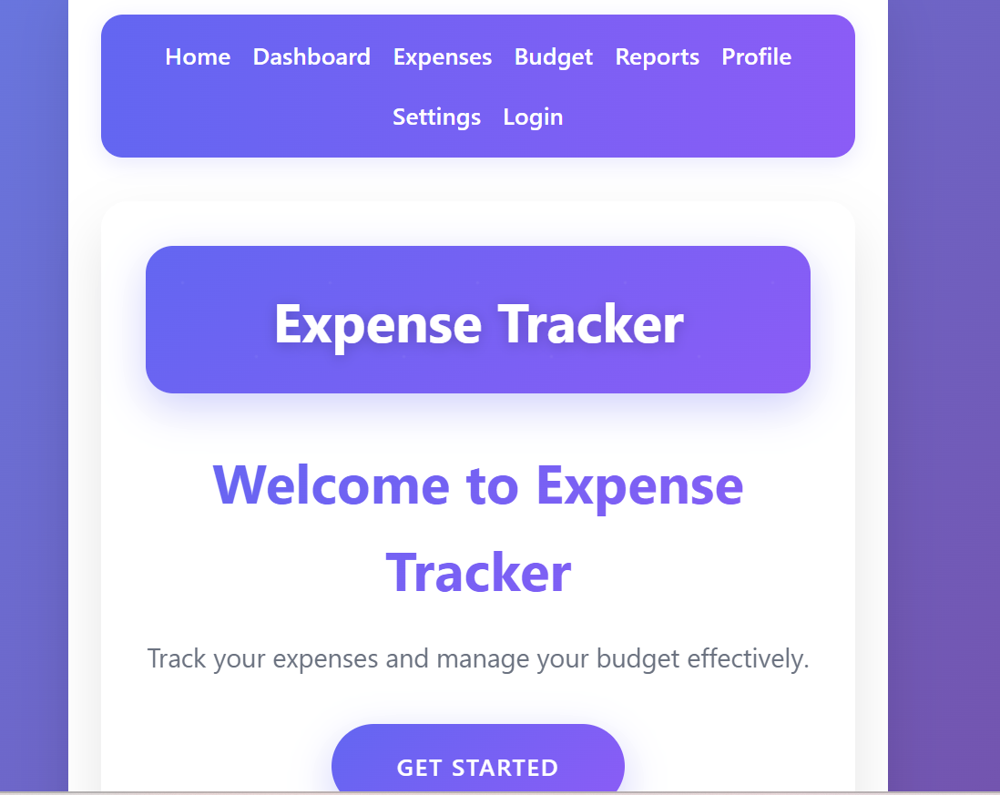
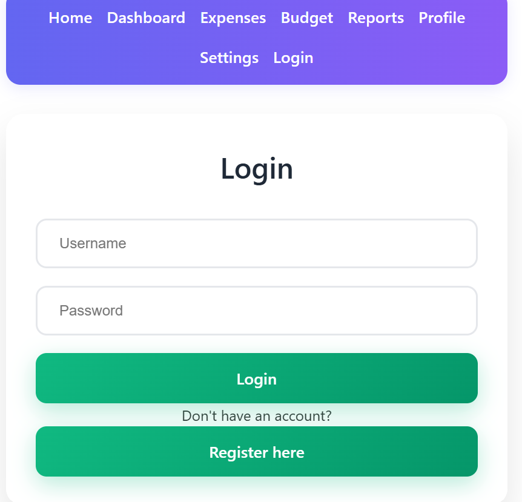
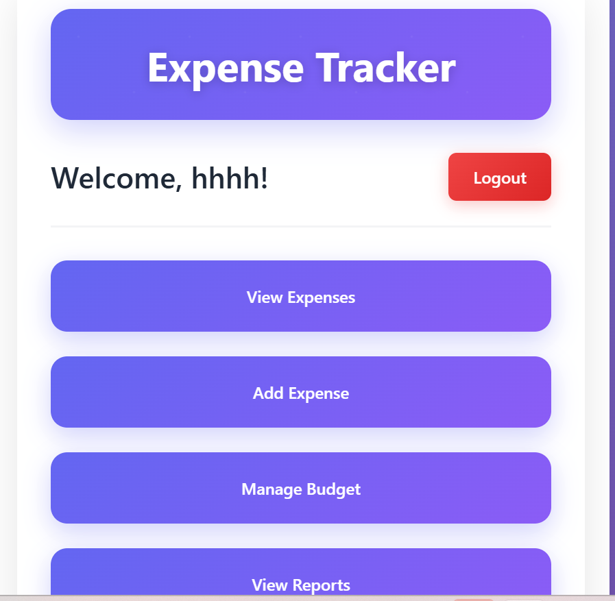
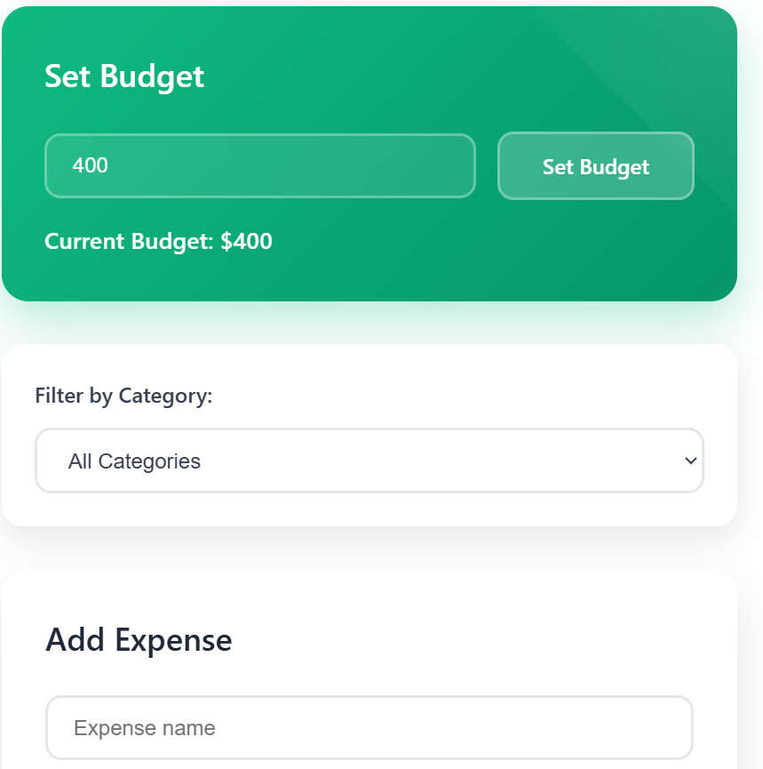
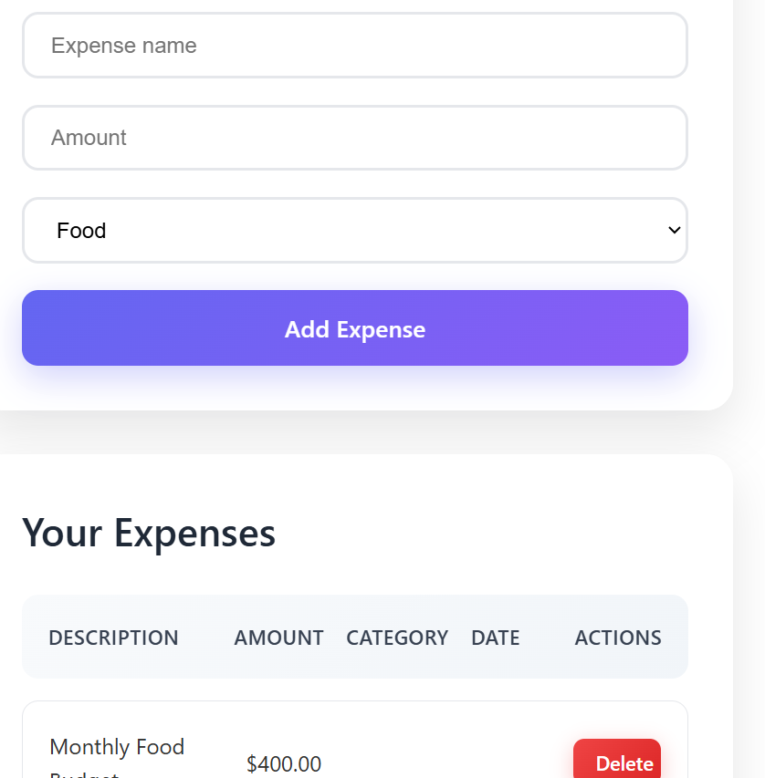

Expense Tracker Application

A modern expense tracking web application built with React and Vite. Manage your personal finances by tracking expenses across different categories.

## Features

- ✨ *Add expenses* with name, amount, and category
- 🗑 *Delete expenses* you no longer need
- ✏ *Edit existing expenses* to update details
- 🔍 *Filter expenses* by category (Food, Utilities, Transport, etc.)
- 📊 *View total spending* across all or filtered expenses
- 📱 *Responsive design* that works on all devices
- 🎨 *Clean UI* with intuitive controls

Visit the website for a to access the app via the link below

 https://group-13-et.netlify.app/

 ## Expense Tracker Screenshot

## Technologies Used

- ⚛ React 18
- ⚡ Vite
- 🎨 CSS Modules
- Public Api

## Installation

1. Clone the repository:
   
   git clone git@github.com:Moringa-SDF-PT10/group-13-project.git.

2. Navigate to the project directory:

  cd group-13-project.git
### Install dependencies:
  npm install

Start the development server:
 npm run dev

Open your browser and visit:

http://localhost:5173

### Available Scripts
npm run dev: Starts the development server

npm run build: Builds the app for production

npm run lint: Runs ESLint to check for code issues

npm run preview: Previews the production build locally

## Project Structure
project-root/
├── public/
│   └── favicon.ico
├── src/
│   ├── assets/
│   │   └── styles/
│   │       └── global.css
│   ├── components/
│   │   ├── common/
│   │   │   └── Header/
│   │   │       └── Header.jsx
│   │   ├── questions/
│   │   │   ├── QuestionForm/
│   │   │   │   └── QuestionForm.jsx
│   │   │   ├── QuestionList/
│   │   │   │   └── QuestionList.jsx
│   │   │   ├── QuestionItem/
│   │   │   │   └── QuestionItem.jsx
│   │   ├── ui/
│   │   │   ├── buttons/
│   │   │   │   └── ToggleButton.jsx
│   │   │   └── cards/
│   │   │       └── QuestionCard.jsx
│   ├── pages/
│   │   ├── Admin/
│   │   │   └── AdminPage.jsx
│   │   └── Quiz/
│   │       └── QuizPage.jsx
│   ├── services/
│   │   └── api.js
│   ├── App.jsx
│   ├── main.jsx
│   └── routes.jsx
├── .eslintrc.cjs
├── .gitignore
├── package.json
├── README.md
└── vite.config.js

## Project Collaborators

### Core Team Members
| Name              | Role                | GitHub Profile | Contributions |
|-------------------|---------------------|----------------|---------------|
| [Chege Wakiama]() | Project Lead        | @ munyanyaguo  | App.jsx, API Services     |
| [Ben Oluoch]()    | Data Management     | @ OluochBen    | Categories.jsx, constants |
| [Faith Wangari]() | Component Developer | @Wangari-69    | Header.js, ExpenseForm.js |
| [Paul Wafula]()   | UI/UX Developer     | @LegrandSir    | Design System, Styling    |

## Contributing
Contributions are welcome! Please follow these steps:

Fork the repository

Create a new branch git checkout -b feature/your-feature

Commit your changes git commit -m 'Add some feature

Push to the branch git push origin feature/your-feature

Open a Pull Request

## License
This project is licensed under the MIT License - see the LICENSE file for details.

## Acknowledgements
Vite for the blazing fast development environment

React for the component-based architecture

Create Vite for the initial project setup
